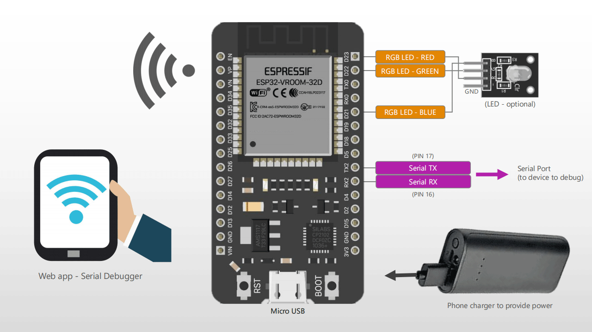

# ESP32-Serial-Debugger
A compact serial communication debugger with ESP32 (WiFi)

It automatically create a WiFi Access Point where phones, PC can connect and visualize the app on with a Web Browser.

- Web User Interface (default IP: 192.168.4.1)
- Possibility to configure the serial port
- Send/Receive data in real-time
- Serial Max Speed: 115.000 baud (free version)

## Screenshots

    

[→ Sample Video](Screenshots/Video_1.mp4)

## TODO
- Automatic serial data generator (to test serial receivers)

## Flashing the ESP32 Firmware
Check out the guide [here](https://www.martinloren.com/guides/fashing-esp32/) 

### V1.1
- Bug fixed
- Added terminal colors (red,green,yellow)
- Enlarged buffer (8KB/200ms)
- Improved UI
- Added support for phone/tablets browsers

### V1.0
- First Release

## How to use
When the ESP is powered it creates an Wifi access point with SSID like ESP-SERIAL-F62684. Connect to it with the phone or PC (password: 123456789) and open the browser (everything except Internet Explorer) at address 192.168.4.1, to access the app.
 
 
