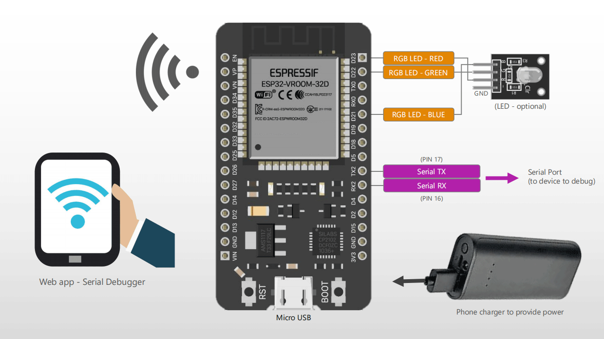
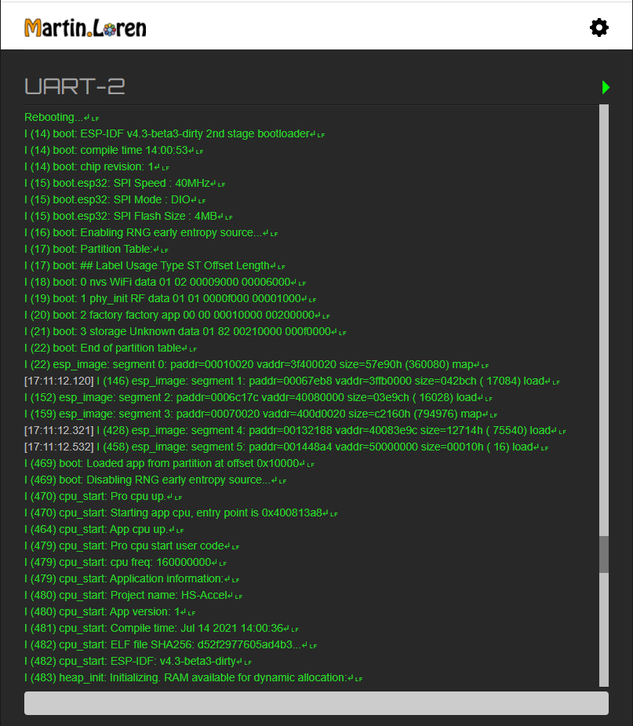
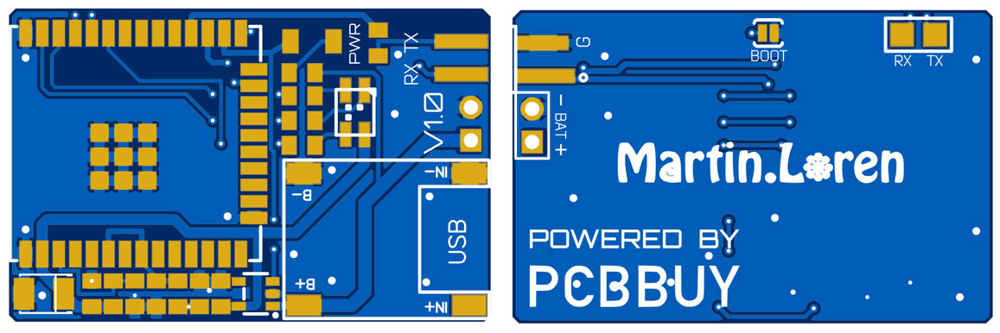

# ESP32-Serial-Debugger
A compact serial port debugger with ESP32 (WiFi). This device act like a serial port to send and receive data through WiFi to your Web Browser.

It can work in AP (create an indipendent WiFi Access Point) or STA mode (connect to your existing WiFi network) where a phone or PC can connect and debug data with a Web Browser.

- Web User Interface (read how to use below)
- Possibility to configure the serial port on-the-fly
- Send/Receive data in real-time
- Serial Max Speed: 115.000 baud (in the free version)

## Advantages
- You don't need to install a software on Windows
- You don't need to restart your serial terminal since the software crash, freeze or the serial port freeze
- You don't need even a PC, you can use a Tablet or a Phone, or you just add a tablet as an additional dedicated screen to your working bench
- You don't need to have a WiFi network, it can create a specific hot spot, use it on-the-fly wherever you are

## Screenshots

    

[→ Sample Video](Screenshots/Video_1.mp4)

## How to use it
When the ESP is powered it creates a Wifi access point with SSID like **ESP-SERIAL-F62684**. 
- Connect to it with the phone or PC (default password: **123456789**)
- Open the browser (everything except Internet Explorer) at address **192.168.4.1**
- In the Settings panel you can configure the Serial Port settings and the WiFi mode

## TODO
- Automatic serial data generator (to test serial receivers)
- Decode data in HEX (beside ASCII)
- Suggestions?

## How to Build it
### Simple Build (NO CUSTOM PCB)
#### What you need
- ESP32 Development board
- RGB LED module (optional)
  
1. Flash the ESP32 Firmware. Check out the guide [here](https://www.martinloren.com/guides/fashing-esp32/) 
2. Power up the ESP32 and connect the serial port indicated in the schematic at the top of this page to the serial port you want to debug. Data will be shown up on the Webpage provided by the ESP32.

### Compact Build (WITH PCB)

#### What you need
- The custom PCB with all the components mounted on (Gerber file, components list and components mounting position in *Schematic_PCB* folder).
  
1. Flash the ESP32 Firmware. Check out the guide [here](https://www.martinloren.com/guides/fashing-esp32/) 
2. Power up the ESP32 and connect the serial port indicated in the schematic at the top of this page to the serial port you want to debug. Data will be shown up on the Webpage provided by the ESP32.

## ESP32 Firmware Changelog
### V1.1
- Bug fixed
- Added terminal colors (red, green, yellow)
- Enlarged buffer (8KB/200ms)
- Improved UI
- Added support for phone/tablets browsers

### V1.0
- First Release

 
 
